# Right Side

Great! Now lets make the right side. Very similar to the left, just a couple small changes. Remember that we're referring to the right side of the machine as seen from the front:

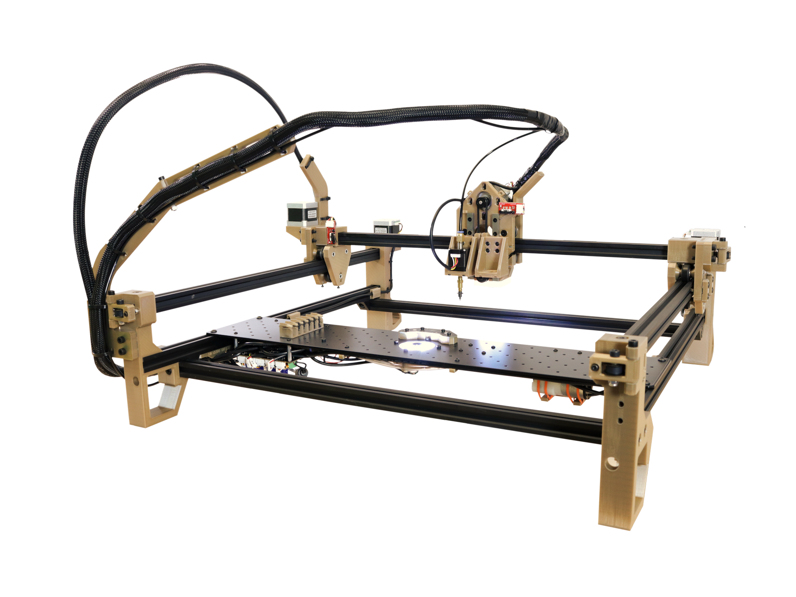{ loading=lazy }

## Assembly

| Qty | Part                          |
|----:|-------------------------------|
| 1   | FDM-0002 (Front Right Leg)    |
| 1   | FDM-0004 (Back Right Leg)     |
| 2   | Aluminum extrusion            |
| 6   | M5 T-slot nut                 |
| 6   | M5x10 machine screw           |
| 1   | NEMA17 stepper motor          |
| 1   | GT2 Pulley (with grub screws) |
| 4   | M3x8 machine screw            |

1. Take the `Front Right Leg` and insert the v-slot extrusions into the two square holes designed to take this part. Ensure that the extrusion comes to the end of the holes in which they're inserted. If you have a hard time getting the extrusion into the slots, gently slide them into place using some taps from a mallet.
    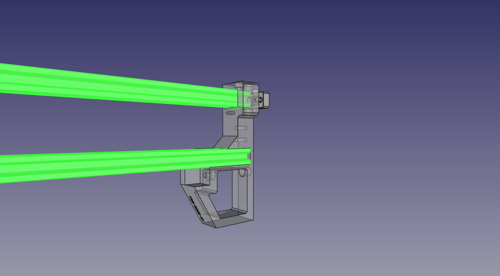{ loading=lazy }

2. Take the `Back Right Leg`. Your progress should look like the image below.
  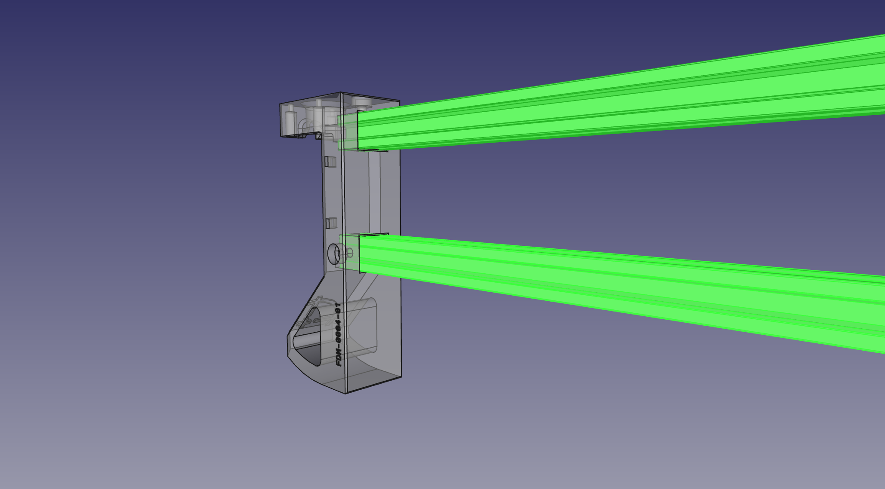{ loading=lazy }
  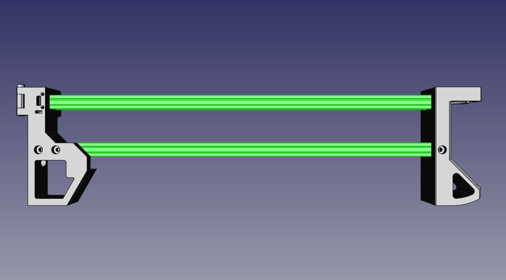{ loading=lazy }

3. On the top rail, drop in and position a slot nut underneath the hole in the top of each leg and screw a M5x10mm machine screw into the nut.
  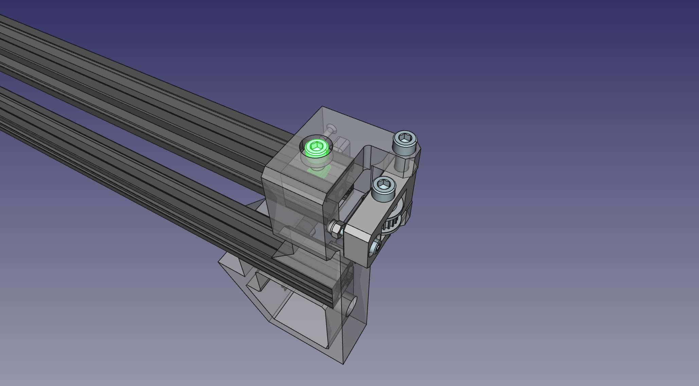{ loading=lazy }
  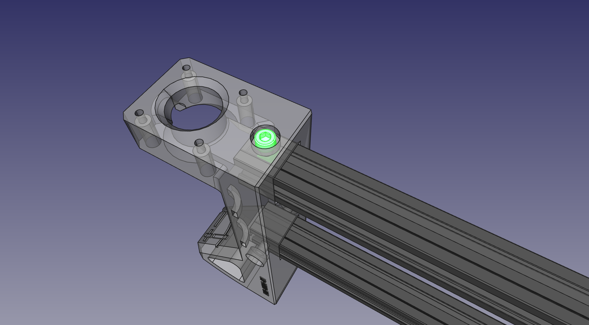{ loading=lazy }
  { loading=lazy }

12. On the bottom rail, the outer side has three exposed holes for machine screws (one on the `Back Right Leg`). For each, drop in and position a slot nut under it and screw a M5x10mm machine screw into it.
  { loading=lazy }
  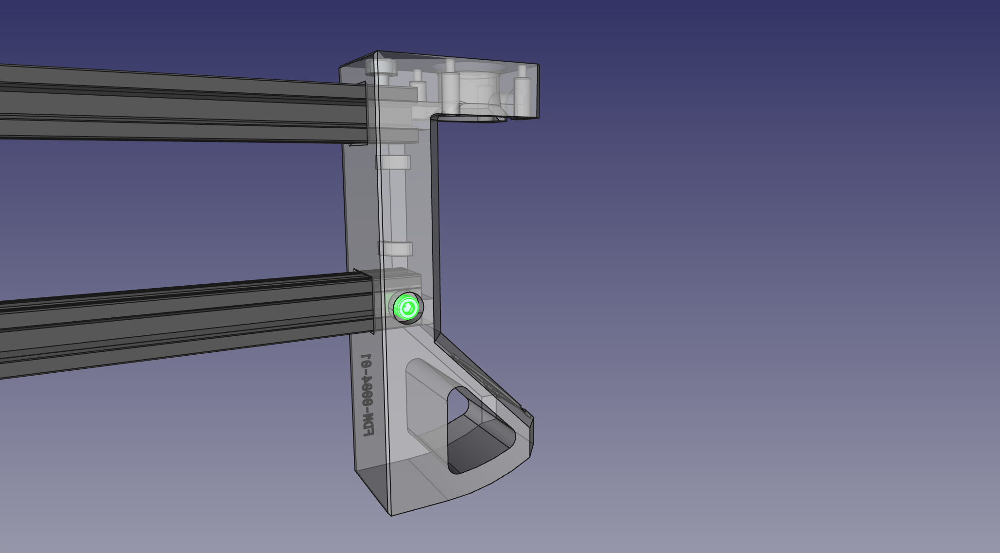{ loading=lazy }
  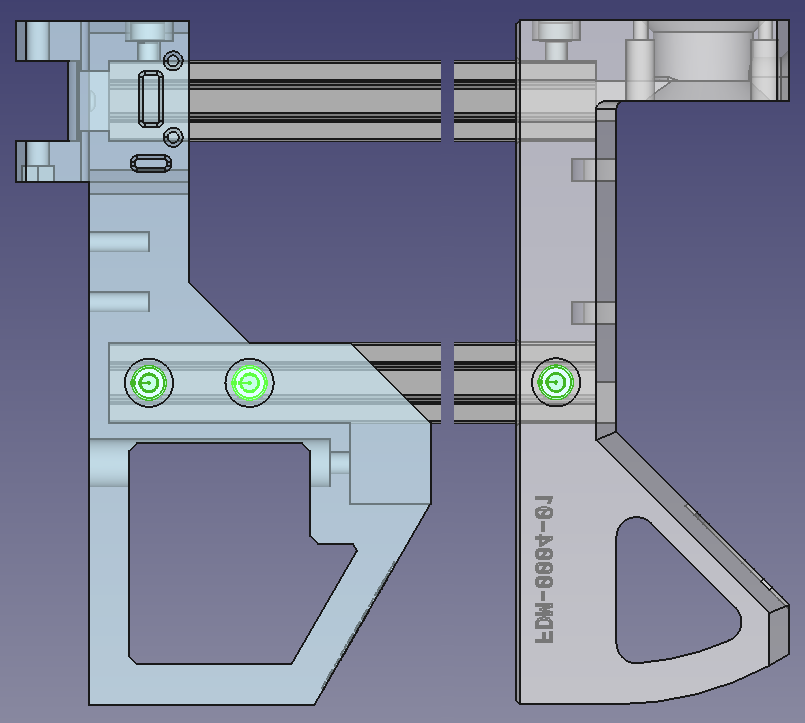{ loading=lazy }

4. On the bottom rail, the inner side has one exposed hole for a machine screw on the `Back Right Leg`. Drop in and position a slot nut under it and screw a M5x10mm machine screw into it.
  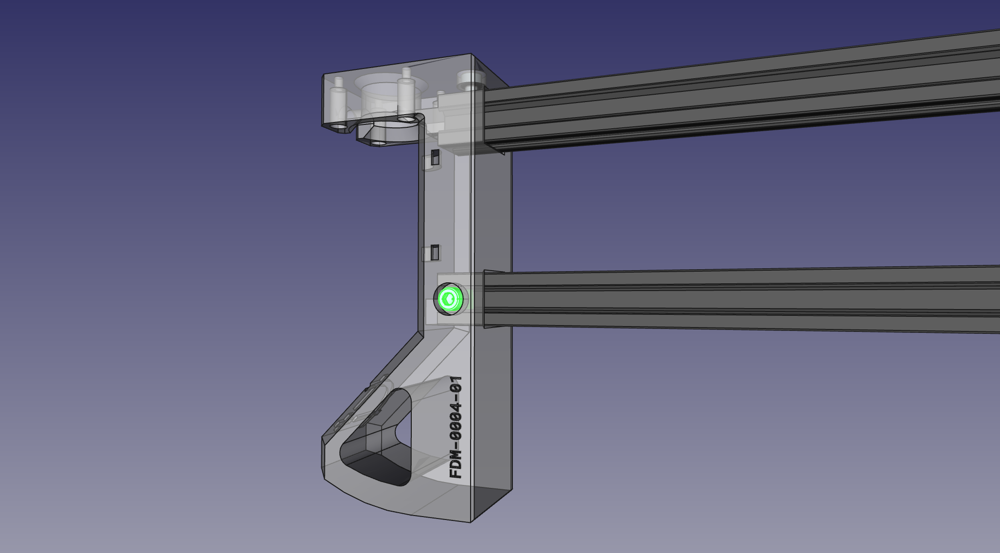{ loading=lazy }
  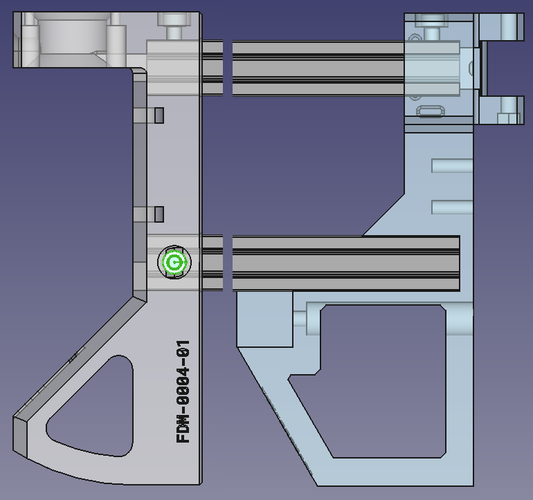{ loading=lazy }

5. Slide the GT2 Pulley onto the the motor shaft of a NEMA17 stepper motor with the set screw side facing the motor body. Align the pulley so that the end is roughly flush with the end of motor shaft, then tighten one of the set screws on the pulley into the flat side of the motor shaft. Tighten the second set screw as well.
  { loading=lazy }

6. Mount the NEMA17 stepper motor to the `Back Right Leg` with four M3x8mm screws, ensuring that the connector is facing inwards towards the zip tie loops as dictated in the picture.
  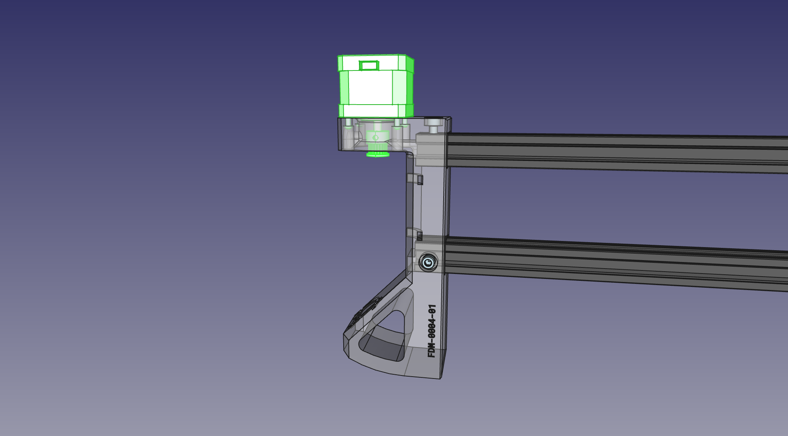{ loading=lazy }
  { loading=lazy }

## Next steps

Continue to [connecting the two sides together](../5-connecting-sides/index.md).
