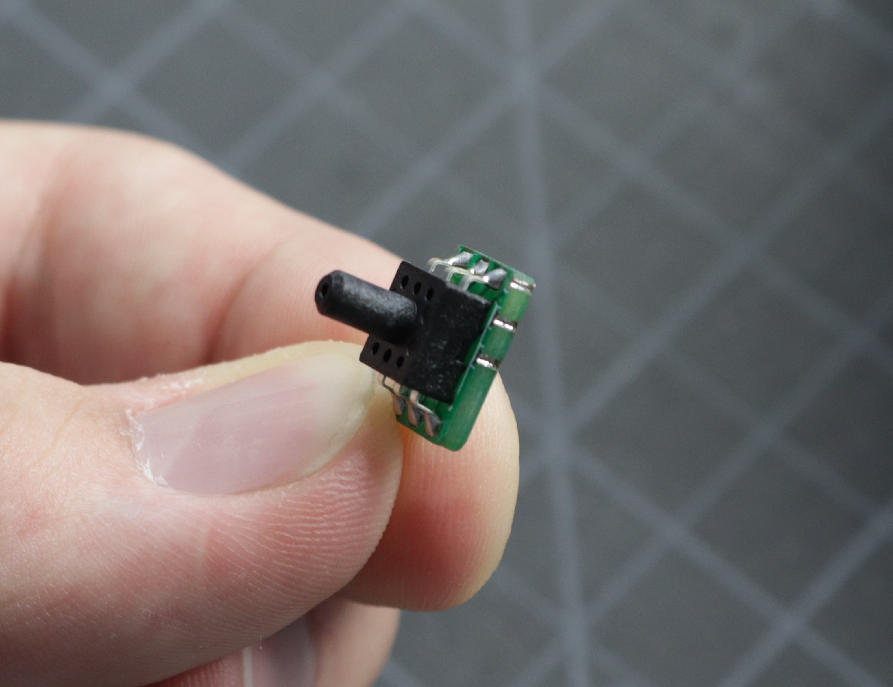
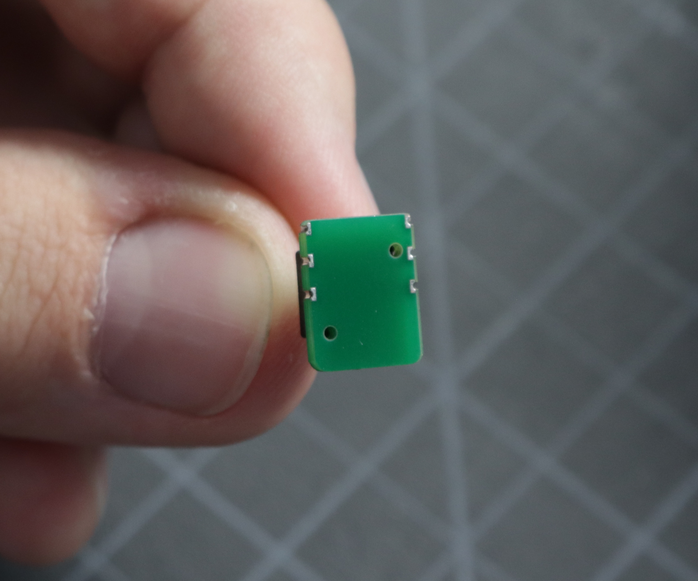
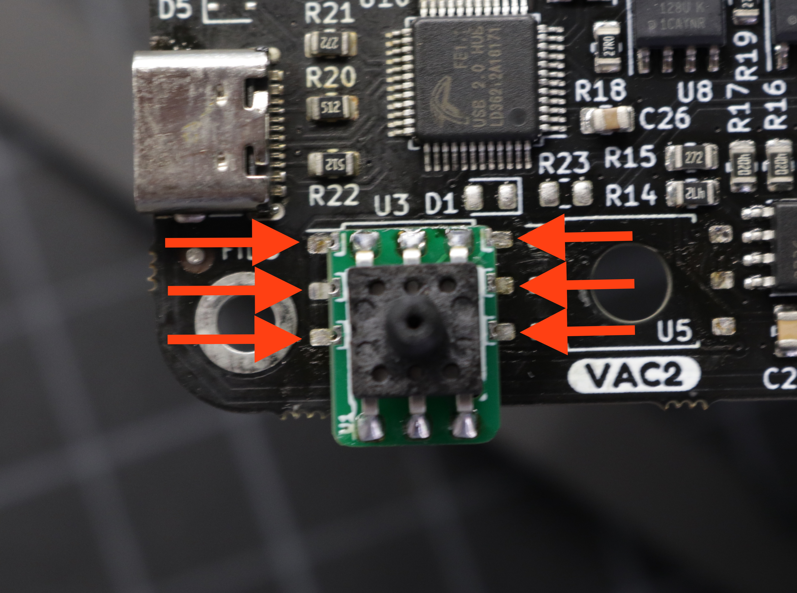

<!-- markdownlint-disable-file MD031-->
# REV03 Motherboard Interposer Installation Guide

This guide is for installing the *Vacuum Sensor Interposer Boards*. Some early units of the LumenPnP shipped with a standard vacuum sensor on the motherboard that has a signal swing of a few hundred units. Because of some variability in the components used, this swing can be too small to get a usable signal for vacuum part-pick detection. This installation makes the signal swing much larger, making it easier to get a usable signal from the sensor.

We're sorry about this! In our internal testing of this feature, we found that the swing was large enough to detect a missed pick accurately, but we didn't test comprehensively enough to ensure it was always the case for every board. We've changed the way we test features before boards leave our facility to catch these types of issues.

!!! danger "Help"
    If you at any time run into trouble or are unsure of how to proceed with this guide, please reach out to our [customer support line](https://opulo.io/pages/contact-support) and we'll get you up and running.

## Timing

This process should take about 60 minutes.

## Tools Needed

* Hot Air Gun
* Soldering Iron
* Tweezers
* Solder
* Solder Wick
* 2x Interposer PCBAs
* Your REV03 Motherboard


## Installation

1. If your board looks like the image below, then you do not have the interposers installed, and this guide is for you! If your vacuum sensors have a little green board between them and the motherboard, you're all set and **don't need to perform this installation**.
   

2. First, you'll need to remove the existing vacuum sensors. You'll find them near the USB-C connector labeled "VAC1" and "VAC2". Using your hot air gun, apply heat to the legs of one of the vacuum sensors on your motherboard. Wait until you see the solder become molten and shiny, then gently remove the sensor from the PCB using tweezers. Perform the same operation for the second sensor.

    
    
    

    !!! danger "Warning"
        Be careful not to tug too hard on the sensor. It's held down to the PCB with just a few copper pads, and pulling too hard might result in lifting those pads off the PCB. Make sure the solder is completely molten and the sensor should come away easily.

3. Remove any remaining solder on the vacuum sensor pads. The pads need to be cleaned and flat for the interposer installation. Use solder wick (and flux if necessary) to remove any solder from the six pads that make up each vacuum sensor footprint. Clean up any excess flux or solder residue.
    

4. Now you can install an interposer board. First, make sure you have the correct board orientation. The bottom of the board has six pads that match the vacuum sensor footprint on the board. Make sure they line up with the footprint and that a bit of the interposer board is hanging off of the edge of the motherboard.
    
    
    Correct orientation

    

    Make sure the six pads of the footprint on the motherboard align with the six plated edges of the interposer board.

    

5. Add a bit of solder to one of the pads on the motherboard, and tack the interposer in place with a bit of solder on one of the pads. Apply heat to this joint while you align the interposer board using your tweezers.
    
    

6. Once your board is aligned with the pads and tacked in place, apply solder to the remaining five pads. Make sure that you have a good fillet of solder connecting the interposer board to the pad on the motherboard.

    
    

7. Repeat steps 4 and 5 with the second interposer board and the second vacuum footprint on the motherboard.

    
    
    

## Checking Readings

1. Check to make sure that the sensor is working properly. Connect to the motherboard with your computer and try sending some GCode commands to it with a GCode sender. We recommend using [CNCjs](https://cnc.js.org/).

    ```gcode
    M3426 G2 C1 I1 A110     ;First sensor command
    M3426 G2 C2 I1 A110     ;Second sensor command
    ```
    When at ambient pressure, the response from each sensor should look something like this:

    ```gcode
    V:29800 C:1 G:2 I:1
    ```

    Make sure the `V` value is about `29800`. Don't worry if it's not exact. As long as it's within `500` of `29800`, it's an acceptable value. If both sensors return an acceptable value, proceed to the next step.

    !!! note "Sensor Address"
        Note that in the above code snippet, the line `M3426 G4 C1 I1 A110` uses `A110` to specify which sensor to read from. Due to the way the sensors are programmed by their manufacturer, the address of the sensor can vary. If `A110` doesn't work for you, try testing each value from `0` to `7` to see which address is correct for your sensors.[^1]

2. Next, check the sensor readings when connected to the pneumatic system. Push the vacuum line onto the `VAC1` sensor.
3. Install the N045 nozzle tip onto the nozzle.
4. Next, turn on the pump for nozzle 1 and its valve using these commands:

    ```gcode
    M106                  ;turn on pump 1
    M106 P1 S255          ;turn on valve 1
    ```

5. With the pump and valve on, read the pressure from the first vacuum sensor:

    ```gcode
    M3426 G2 C1 I1 A110
    ```

    You should read a value of about `15500`. Don't worry if it's not exact. As long as it's within `13000` - `18000`, it's an acceptable value. Record this number.

6. Now, cover the tip of the nozzle with your finger and re-run the command. *Make sure the pump and valve are still running.* Record this number. Turn off the pump and valve using the following commands:

    ```gcode
    M107                  ;turn off the pump
    M107 P1               ;turn off the valve
    ```

    You should read a value that is around `2000` less than the uncovered value. Record this number.

7. Remove the vacuum tube from `VAC1` and install it onto `VAC2`.
8. Repeat steps 9, 10, and 11 again to check the second sensor. You'll need to use `M3426 G2 C2 I1 A110` to read the pressure from the second sensor instead of the first.
9. Remove the vacuum tube from `VAC2` and install it back onto `VAC1`.
10. If any of the sensor values were not in the acceptable range, re-assess the soldering joints of the interposer board onto the motherboard and make sure they're all connected with a solid joint. If you are still unable to get a good reading, please reach out to our [support line](https://opulo.io/pages/contact-support) and we'll make sure you get up and running.

[^1]: See [this](https://github.com/MarlinFirmware/Marlin/pull/24130) change to Marlin and the manufacturer's [data sheet](http://ww1.microchip.com/downloads/en/DeviceDoc/22226a.pdf) for more details.
